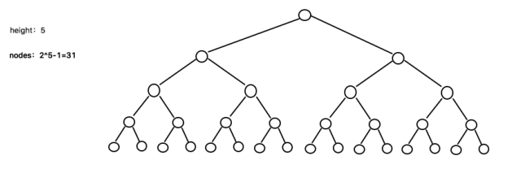
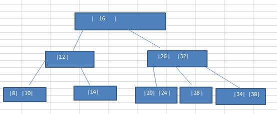

# 多路查找树

- 二叉树的问题分析

  - 二叉树的操作效率较高，但是也存在问题, 请看下面的二叉树

  
  

  - 二叉树需要加载到内存的，如果二叉树的节点少，没有什么问题，但是如果二叉树的节点很多(比如1亿)， 就存在如下问题:

    - 问题1：在构建二叉树时，需要多次进行i/o操作(海量数据存在数据库或文件中)，节点海量，构建二叉树时，速度有影响

    - 问题2：节点海量，也会造成二叉树的高度很大，会降低操作速度.

- 多叉树

  - 在二叉树中，每个节点有数据项，最多有两个子节点。如果允许每个节点可以有更多的数据项和更多的子节点，就是多叉树（multiway tree）
  - 后面我们讲解的2-3树，2-3-4树就是多叉树，多叉树通过重新组织节点，减少树的高度，能对二叉树进行优化。
  - 举例说明(下面2-3树就是一颗多叉树)

  
 

- B树的基本介绍

  - B树通过重新组织节点，降低树的高度，并且减少i/o读写次数来提升效率。

  
 

  1. 如图B树通过重新组织节点， 降低了树的高度.
  2. 文件系统及数据库系统的设计者利用了磁盘预读原理，将一个节点的大小设为等于一个页(页得大小通常为4k)，这样每个节点只需要一次I/O就可以完全载入
  3. 将树的度M设置为1024，在600亿个元素中最多只需要4次I/O操作就可以读取到想要的元素, B树(B+)广泛应用于文件存储系统以及数据库系统中

## 1. 2-3树

### 1.1 2-3树基本介绍

- 2-3树是最简单的B树结构, 具有如下特点:
  - 2-3树的所有叶子节点都在同一层.(只要是B树都满足这个条件)
  - 有两个子节点的节点叫二节点，二节点要么没有子节点，要么有两个子节点.
  - 有三个子节点的节点叫三节点，三节点要么没有子节点，要么有三个子节点.
  - 2-3树是由二节点和三节点构成的树。 

### 1.2 2-3树应用案例

- 将数列{16, 24, 12, 32, 14, 26, 34, 10, 8, 28, 38, 20} 构建成2-3树，并保证数据插入的大小顺序。(演示一下构建2-3树的过程.)


 

- 插入规则:
  - 2-3树的所有叶子节点都在同一层.(只要是B树都满足这个条件)
  - 有两个子节点的节点叫二节点，二节点要么没有子节点，要么有两个子节点.
  - 有三个子节点的节点叫三节点，三节点要么没有子节点，要么有三个子节点
  - 当按照规则插入一个数到某个节点时，不能满足上面三个要求，就需要拆，先向上拆，如果上层满，则拆本层，拆后仍然需要满足上面3个条件。 
  - 对于三节点的子树的值大小仍然遵守(BST 二叉排序树)的规则

## 2. B树、B+树和B*树

### 2.1 B树

#### 2.1.1 介绍：

- 前面已经介绍了2-3树和2-3-4树，他们就是B树(英语：B-tree 也写成B-树)，这里我们再做一个说明，我们在学习Mysql时，经常听到说某种类型的索引是基于B树或者B+树的，如图:


 

#### 2.1.2 B树的说明:

- B树的阶：节点的最多子节点个数。比如2-3树的阶是3，2-3-4树的阶是4
- B-树的搜索，从根结点开始，对结点内的关键字（有序）序列进行二分查找，如果命中则结束，否则进入查询关键字所属范围的儿子结点；重复，直到所对应的儿子指针为空，或已经是叶子结点

- 关键字集合分布在整颗树中, 即叶子节点和非叶子节点都存放数据.
- 搜索有可能在非叶子结点结束
- 其搜索性能等价于在关键字全集内做一次二分查找

### 2.2 B+树

#### 2.2.1 B+树的介绍

B+树是B树的变体，也是一种多路搜索树。


 

#### 2.2.2 B+树的说明:

B+树的搜索与B树也基本相同，区别是B+树只有达到叶子结点才命中（B树可以在非叶子结点命中），其性能也等价于在关键字全集做一次二分查找
所有关键字都出现在叶子结点的链表中（即数据只能在叶子节点【也叫稠密索引】），且链表中的关键字(数据)恰好是有序的。
不可能在非叶子结点命中
非叶子结点相当于是叶子结点的索引（稀疏索引），叶子结点相当于是存储（关键字）数据的数据层
更适合文件索引系统
B树和B+树各有自己的应用场景，不能说B+树完全比B树好，反之亦然.

### 2.3 B*树

#### 2.3.1 B*树的介绍

B*树是B+树的变体，在B+树的非根和非叶子结点再增加指向兄弟的指针。


 

#### 2.3.2 B*树的说明:

- B\*树定义了非叶子结点关键字个数至少为(2/3)*M，即块的最低使用率为2/3，而B+树的块的最低使用率为B+树的1/2。
- 从第1个特点我们可以看出，B*树分配新结点的概率比B+树要低，空间使用率更高
